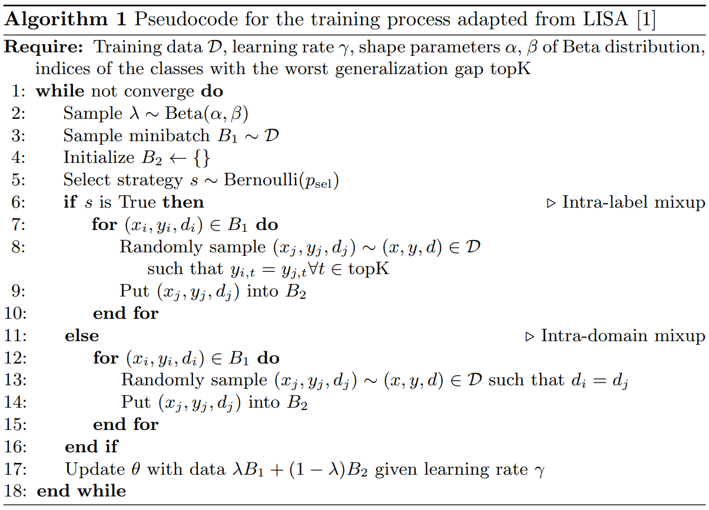

# LISA-topK

[MICCAI UNSURE 2023] [Breaking Down Covariate Shift on Pneumothorax Chest X-ray Classification](https://link.springer.com/chapter/10.1007/978-3-031-44336-7_16)

## Abstract

Domain shift poses significant problems to computer-aided diagnostic (CAD) systems when deployed in clinical scenarios. There’s still no definite fix nor an in-depth understanding of the exact factors driving domain shifts in medical X-rays. Here, we conduct an exploratory study on three covariate shift factors in X-ray classification by controlling for different variables. This is possible by leveraging a homogenously-relabelled mix of public and private X-ray data spanning 23 medical institutions over four continents and 17 classes of pathologies. We show that the acquisition parameter, device manufacturer and geographical shifts degrade out-of-distribution (OOD) F1 by 6%, 3.2% and 3.3%, respectively. Pneumothorax was found to be the most impaired pathology, suffering a mean F1 generalisation gap of 13.3%, despite being one of the most clinically-consequential radiological findings. To this end, we introduced LISA-topK, a multi-label adaptation of Learning Invariant Predictors with Selective Augmentation (LISA), that we showed to narrow down the OOD gap, surpassing other methods consistently. These pragmatic results shed light on some of the elements of OOD generalisation in X-ray classification, which are essential to researching, understanding and deploying CAD systems.

## Algorithm

We provide a straightforward pseudocode outlining the selection strategy from [dataset.py](utils/dataset.py). Our implementation is based on [LISA](https://github.com/huaxiuyao/LISA). It's important to note that our codebase relies on a proprietary dataset.



## Citation

If you found our research useful, please cite the following paper:

```
@inproceedings{bercean2023breaking,
  title={Breaking Down Covariate Shift on Pneumothorax Chest X-Ray Classification},
  author={Bercean, Bogdan and Buburuzan, Alexandru and Birhala, Andreea and Avramescu, Cristian and Tenescu, Andrei and Marcu, Marius},
  booktitle={International Workshop on Uncertainty for Safe Utilization of Machine Learning in Medical Imaging},
  pages={157--166},
  year={2023},
  organization={Springer}
}
```
